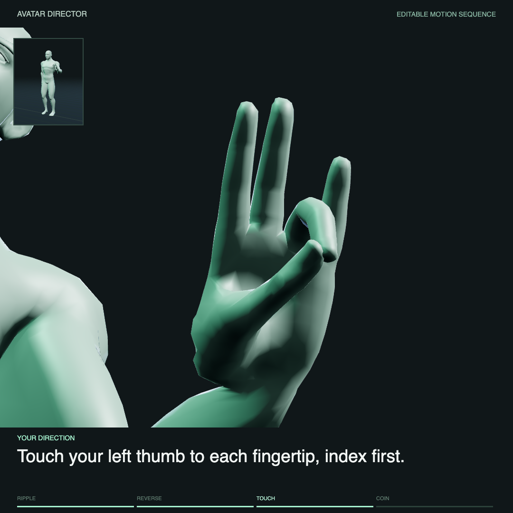

# Avatar

Direct a 3D character with words. Edit the motion down to individual finger joints.

[Try the demo](https://programasweights.com/avatar) · [Watch the sequence](https://programasweights.com/avatar/showcase.mp4)

[](https://programasweights.com/avatar)

> “Make a wave from pinky to thumb on your left hand.”  
> “Touch your left thumb to each fingertip, index first.”  
> “Roll a coin across your left knuckles.”

The studio includes a complete hand sequence, dance studies, 52 articulated
joints, editable motion trees and video export. Small [PAW](https://programasweights.com)
functions turn language into validated commands; the motion engine animates the character.

## Run

Requires Node.js 22.12 or newer.

```sh
git clone https://github.com/programasweights/avatar.git
cd avatar
npm ci
npm run dev
```

Open the local URL printed by Vite. **Play full sequence** runs immediately.
The bundled character, examples, joint controls and JSON editor work without
Python or model downloads.

## Direct with words

For language input, install Python 3.10 or newer and the local PAW runtime:

```sh
python3 -m venv .venv
.venv/bin/python -m pip install -r requirements.txt
npm run dev
```

On Windows, use `.venv\Scripts\python.exe` instead of `.venv/bin/python`.
The app discovers `.venv` automatically; `AVATAR_PYTHON` can select another
Python executable.

The first direction downloads the pretrained models. Subsequent inference runs
locally, with models retained in one worker and requests processed sequentially.
No API key or recompilation is required. The example buttons play authored
motions; **Direct** interprets your text with PAW.

Try **Finger ripple**, select **Ring finger** in the motion tree, and press
**Pause finger**. Its three joints stay fixed while the other fingers continue.
**Restore motion** brings it back. Expand a finger to select one joint and
change its curl with the slider; **Undo** restores the previous edit.

[Watch the joint-control recording](https://programasweights.com/avatar/joint-control.mp4).

You can also type “Keep the wave going. Stop just the ring finger,” then
“Restore the ring finger.” An omitted side uses the active hand. “This joint”
uses the current tree selection. Pauses hold local joint rotations; contact
choreography and leg IK need their own trajectory controls.

Language can misinterpret wording: “Could you move just your left thumb?”
currently pauses it. “Move your left thumb” follows the movement path.

**More motions** contains the other studies and hand selection. **Edit motion**
contains detailed curves, joint axes, skeleton inspection and JSON import/export.
**Full tree** reveals the pose and camera branches folded out of the compact view.

Use **Recording view** for a large stage, or record while editing in the normal
view. The video includes the current instruction, selected branch and angle or
pause state. Recording starts from the current playhead and downloads a square
video in a format supported by your browser.

## Render an MP4

Install FFmpeg and Playwright’s Chromium once:

```sh
npx playwright install chromium
npm run render
```

This writes `exports/showcase.mp4`: the full hand sequence at 1080 × 1080,
24 fps. Rendering starts its own local server and does not require PAW.
Set `FFMPEG` if the executable is not on your PATH.

To render an exported motion:

```sh
npm run render -- --input motion.json --output exports/my-motion.mp4
```

Use `--side right` for the default right-hand showcase, or `--preview` to
inspect still frames before encoding a video.

## How it works

- `director.py`, `programs.json`, `specs/`: small pretrained language functions
  and strict command validation.
- `src/motion/`: `sequence`, `parallel` and `repeat` trees containing continuous
  curves and contacts; choreography builders, joint control and contact solvers.
- `src/App.tsx`: the studio, timeline and tree editor.

A new skill is an ordinary motion-tree builder. Add its command to the director
and extend the relevant PAW specification when it needs language support.
The language vocabulary covers the supplied skills and joint edits; new complex
actions need choreography. Contacts and coin motion are kinematic, not a physics
simulation.

See [MOTION.md](MOTION.md) for the tree format and a minimal finger example.

Run `npm test` for browser and motion regressions, `npm run test:director` and
`npm run test:worker` for language/worker checks, and `npm run build` for a production build.
These tests use mocked neural outputs; `AVATAR_LIVE_PAW=1 npm test` also runs
the opt-in local inference checks.
The built `dist/` can serve the examples and editor as a static site. Language
input also needs a backend at `/api/direct`; `npm run dev` and `npm run preview`
provide the included local Python bridge. A hosted site can connect that route
to its own PAW inference provider.

## Character and license

Code: [MIT](LICENSE). Bundled character: Quaternius, [CC0](ASSETS.md), styled as a
matte jade mannequin. The character ships with the app; Blender is optional.
[ASSETS.md](ASSETS.md) explains how to rebuild it or import your own Mixamo Y Bot
for local use with `?character=mixamo`.
